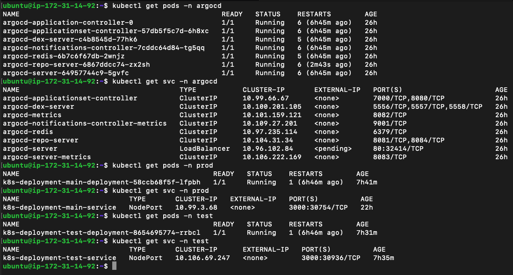
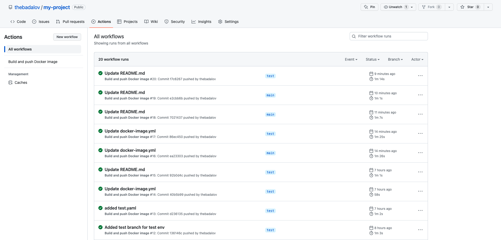
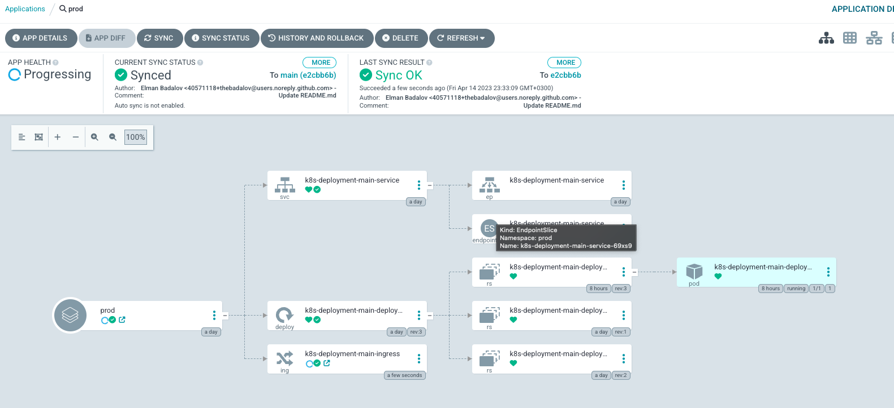
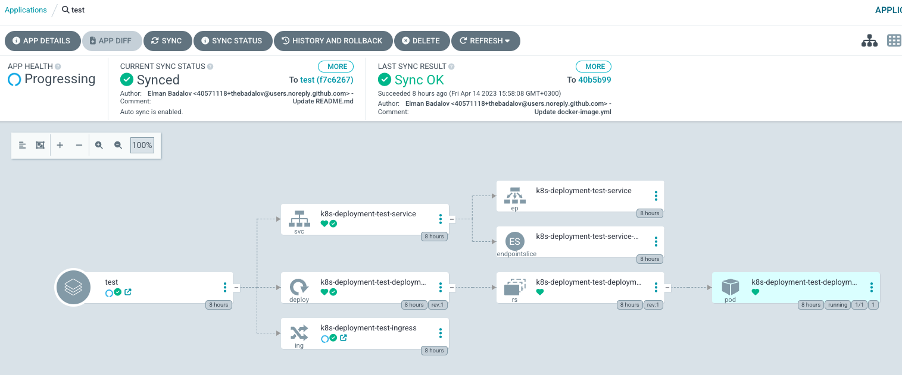

MY-PROJECT
---------------------
The project is a POC study and consists of the deployment model of the netjs application as end2end to the test and production namespaces installed on minikube k8s.
- EC2 server installed on AWS.

You can see EC2 instance info;

- Minikube, docker, k8s, argocd installations on the server have been completed.

You can see Minikube K8S cluster, ArgoCD, Prod and Test ENV pod/svc info;

- Github CI & Argo CD opensource tool was used for CI / CD process.

You can check Github CI processes;

Prod and Test Argo CD processes;

- It's set to trigger when push to Github test and prod(main) branches with spesific run_id tag in CI step.
- Automatic CI step will be triggered when push command comes with the same line of code from both prod and test branch.
- Helm chart structure was used with Argo, the k8s deployment model.
- The private docker hub repository was used for the image repository and the Secret information was kept on the cluster.
