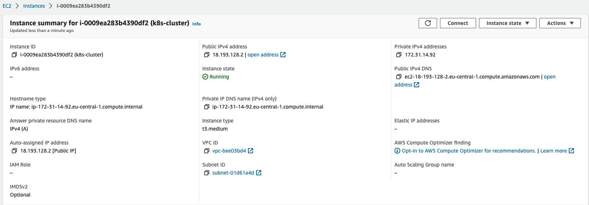

MY-PROJECT
---------------------
First WAY for Test ENV
---------------------
The project is a POC study and consists of the deployment model of the netjs application as end2end to the test and production namespaces installed on minikube k8s.
- EC2 server installed on AWS.

You can see EC2 instance info;

- Minikube, docker, k8s, argocd installations on the server have been completed.
- Github CI & Argo CD opensource tool was used for CI / CD process.
- It's set to trigger when push to Github test and prod(main) branches in CI step.
- Helm chart structure was used with Argo, the k8s deployment model.
- The private docker hub repository was used for the image repository and the Secret information was kept on the cluster.
---------------------
Second WAY for Prod ENV
---------------------
- I used open source Jenkins tool for CI/CD operation.
- In the same way I used ArgoCD for CD and I triggered from JenkinsfileDeploy Pipeline
- I used this way for production CI/CD path.

---------------------
NOT
---------------------
The purpose of using Jenkins was due to the port export problem I had in Argocd. Argocd is accessible via Load Balancer Service, not Node Port for access. Therefore, the port can be exported only with ingress. For this, I made the CI/CD structure from Jenkins to trigger over localhost on the same machine by using Jenkins in addition to the Prod environment.
